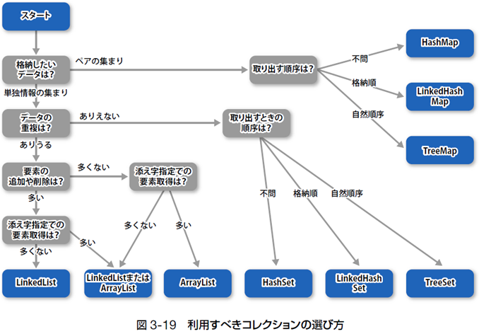

# 第1章　プログラムの書き方

### 開発と実行の流れ
- Javaの文法に従いソースコードを作成する。 
- ソースコードをコンパイラでコンパイルして、バイトコードに変換する。 
- インタプリタはバイトコードをマシン語に変換しながらCPUを動かす。 

### 開発の流れと基本構造
- ソースコードはブロックによる二重構造を持っている。 
- 外側部分は形式的記述であり、内側に文を並べる。 
- 読みやすいソースにするためコメントとインデントを活用する。 

### 変数宣言の文
- 変数は「型変数名;」で宣言して利用する。 
- 変数名は基本的に自由だが、一定の制約がある。 
- 変数には代表的な9つの型があり、用途に合わせて使い分ける。 
- finalを付けて宣言された定数の値は書き換えられない。 

# 第2章　式と演算子

### 式
- 式は演算子とオペランドで構成されている。 
- リテラルにも型があり記述方法で決定される。 
- 演算子が評価されると、その演算子とオペランドは結果に化ける。 
- 演算子は優先順位と結合規則に従い評価される。 

### 型変換
- 大きい変数に小さなデータを代入する際、自動的に型が変換され代入される。 
- 小さな変数に大きなデータを代入する際、キャストを行うことで代入できる。 
- 式の評価時、大きなデータに揃えるよう自動的に型が変換される。 

### 命令の実行
- Javaに用意されている、様々な命令を実行することができる。 

# 第3章　条件分岐と繰り返し

### 制御構文
- 順次- 分岐- 繰り返しの3つの制御構造を組み合わせることで、どのようなプログラムも作成できる。 
- 分岐と繰り返しは「条件式」と「ブロック」から構成されている。 
- 条件式の評価結果はtrueまたはfalseでなければならない。 
- 文字列を比較する時は「==」ではなく「equals」を使用する。 
- ブロック内で定義した変数はブロック終了とともに消滅する。 
- 制御構文はネストできる。 

### 分岐
- if文またはswitch文を使用して分岐を実現する。 
- if文は「ifのみの構文」「if-else構文」「if-elseif-else構文」の3種類。 
- switch文のブロックはbreak文で抜けることができる。 

### 繰り返し
- while文、do-while文またはfor文を使用して繰り返しを実現できる。 
- while文のブロックは最低0回以上、do-while文のブロックは最低1回以上実行される。 
- for文はループ変数を用いて「～回繰り返す」という場面に使用する。 
- break文を実行すると繰り返し自体を中断し、continue文を実行すると繰り返しの次の周回へ進むことができる。 

# 第4章  配列

### 配列の基礎
- 配列とは、同じ型の複数の値をまとめて扱うためのデータ構造。 
- 配列を構成するそれぞれの箱を要素、何番目の箱であるかという数字を添え字またはインデックスという。配列の添え字は0から始まる。 

### 配列の準備
- 配列を利用するためには、「配列変数の宣言」「要素の作成」という2つのステップで配列を準備しなければならない。 
- 配列変数の型には「要素の型［］」を指定する。 
- 要素を作成するには、「new要素の型［要素数］」とし、配列変数に代入する。 

### 配列の利用
- 「配列変数名［添え字］」でそれぞれの要素を読み書きできる。 
- for文や拡張for文を用いて配列要素に1つずつ順番にアクセスする。 

### 配列と参照
- 配列変数は、配列の実体（newで確保された各要素のメモリ領域）を参照している。 
- 特別な値nullが代入された配列変数は、どの実体も参照しない。 
- 何らかの理由で参照されなくなったメモリ領域は、ガベージコレクションによって自動的に解放される。 

# 第5章  メソッド

### メソッド
- メソッドでコードを部品化することができる。 
- クラスブロックの中にメソッド定義を宣言することができる。 

### 引数
- メソッドの呼び出し時に、引数として値を渡すことができる。 
- メソッドを呼び出す時に渡す値を実引数、受け取る側の変数を仮引数という。 
- メソッド内で宣言した変数はローカル変数といい、ほかのメソッドからは使用できない。また、そのメソッドの実行が終わるとローカル変数は消滅する。 

### 戻り値
- return文を使用してメソッドの呼び出し元へ値を戻すことができる。 
- 戻す値の型はメソッドの定義で宣言する必要がある。 
- 戻り値を受け取るには代入演算子「=」を使用する。 

### メソッドの活用
- 仮引数の数と型が異なる同じ名前のメソッドを定義することができる（オーバーロード）。 
- 配列を渡す時、あるいは戻す時は、配列そのものではなく配列のアドレスを渡している。 

# 第6章  複数クラスを用いた開発

### クラスの分割
- 複数のクラスで1つのプログラムを構成することができる。 
- 別のクラスのメソッドを呼び出す場合は、「クラス名.メソッド名」と指定する。 
- Javaプログラムの完成像は複数のクラスファイルの集合体である。 
- 実行する際には、mainメソッドが含まれるクラスのFQCNを指定してjavaコマンドを起動する。 

### パッケージ
- package文を用いて、クラスをパッケージに所属させることができる。 
- import文を使うと、コード中のFQCN指定を省略できる。 

### API
- Javaにあらかじめ添付されている多数のクラス群をAPIという。 
- APIは通常「java.」や「javax.」で始まるパッケージ名を用いている。 
- java.langパッケージに属するクラスは自動的にインポートされる。 
- APIに用意されているクラスは、APIリファレンスで調べることができる。 

### クラスローダーの動作
- クラスローダーは、読み込み対象クラスのFQCNに基づき、クラスパスを基準としてパッケージ階層に従ったフォルダ構成内を探し、読み込む。 
- コンパイルして生成したクラスファイルは、実行時にクラスローダーが見つけられるように、適切なフォルダに配置しなければならない。 

# 第7章  オブジェクト指向をはじめよう

### 学習方法の違い
- 第Ⅱ部ではオブジェクト指向という「考え方」を学ぶため、「文法」を学んだ第I部とは学び方を変える必要がある。 
- 第Ⅱ部ではイメージを重視し、各章を繰り返し学んでいくことで、ぼんやりとした理解を少しずつ明確にしていく。 
- 初めからオブジェクト指向のすべてをマスターする必要はない。まずは第11章までの「1周目」の達成が目標。 

### オブジェクト指向の概要と本質
- オブジェクト指向とは、ソフトウェアを開発する際に用いる部品化の考え方。 
- オブジェクト指向を用いると、大規模で複雑なソフトウェアであっても、ラクして、楽しく、良いものを開発できる。 
- オブジェクト指向の本質は、現実世界における「登場人物とそのふるまい」を、仮想世界においても「オブジェクトたちとそのふるまい」として再現すること。 
- オブジェクトは属性と操作を持つことによって、現実世界と同様の責務を果たす。 
- オブジェクト指向の本質に沿った開発を支援するために準備されている「カプセル化」「継承」「多態性」などの機能を用いたプログラム開発は、第10章～第13章で学ぶ。 

# 第8章  インスタンスとクラス

### インスタンスとクラス
- インスタンスとクラスはまったく別のものであり、混同してはならない。 
- 仮想世界で活動するのは「インスタンス」（オブジェクトとも言う）。 
- インスタンスを生み出すための金型が「クラス」。 

### フィールドとメソッド
- クラスには、属性としてフィールドを、操作としてメソッドを宣言する。 
- finalが付いたフィールドは、定数フィールドであり値が不変になる。 
- thisは「自分のインスタンス」を表すキーワードである。 

### クラス型
- クラスを定義することにより、そのクラス型の変数を宣言できるようになる。 
- あるクラス型の変数には、そのクラスのインスタンスを格納できる。 

### インスタンス化
- new演算子を用いることで、クラスからインスタンスを生み出せる。 
- あるクラス型変数にインスタンスが格納されている時、「変数名.フィールド名」や「変数名.メソッド名()」で、そのインスタンスのフィールドやメソッドを利用することができる。 

# 第9章  様々なクラス機構

### クラス型と参照
- クラス型変数の中には、「インスタンスの情報が格納されているメモリ番地」が入っている。 
- あるクラス型変数を別変数に代入すると、番地情報だけがコピーされる。 
- クラス型は、フィールドやメソッドの引数- 戻り値の型としても利用できる。 

### コンストラクタ
- 「クラス名と同一名称で、戻り値の型が明記されていないメソッド」はコンストラクタとして扱われる。 
- コンストラクタは、newによるインスタンス化の直後に自動的に実行される。 
- 引数を持つコンストラクタを定義すると、newをする際に引数を指定してコンストラクタを実行させることができる。 
- コンストラクタはオーバーロードにより複数定義できる。 
- クラスにコンストラクタ定義が1つもない場合に限って、コンパイラが｢引数なし- 処理内容なし｣のデフォルトコンストラクタを自動定義してくれる。 
- this()を用いれば、同一クラスの別コンストラクタを呼び出すことができる。 

### 静的メンバ
- staticキーワードが付いている静的メンバ（フィールドおよびメソッド）は、 
①各インスタンスにではなく、クラスに実体が準備される。 
②「クラス名.メンバ名」、「インスタンス変数名.メンバ名」のどちらでも同じ実体にアクセスすることになる。 
③1つもインスタンスを生み出していなくても利用可能である。 
- 静的メソッドは、その内部で静的ではないメソッドやフィールドを利用することができない。 

# 第10章  カプセル化

### カプセル化の概要
- カプセル化を用いるとメンバやクラスについてアクセス制御が可能になる。 
- 特に、フィールドに「現実世界ではありえない値」が入らないように制御する。 

### メンバに対するアクセス修飾
- private指定されたメンバは、同一クラス内からしかアクセスできない。 
- package private指定されたメンバは、同一パッケージ内のクラスからしかアクセスできない。なお、メンバ宣言に特定のアクセス修飾子を付けなければpackage privateになる。 
- public指定されたメンバは、すべてのクラスからアクセスできる。 

### クラスに対するアクセス修飾
- package private指定（修飾子なし）で宣言されたクラスは、同一パッケージ内のクラスからしかアクセスできない。 
- public指定されたクラスは、すべてのクラスからアクセスできる。 

### カプセル化の定石
- クラスはpublic、メソッドはpublic、フィールドはprivateで修飾する。 
- フィールドにアクセスするためのメソッドとしてgetterやsetterを準備する。 
- setter内部では引数の妥当性検査を行う。 

# 第11章  継承

### 継承の基礎
- extendsを使うことで、既存のクラスに基づき新たにクラスを定義できる。 
- 親クラスのメンバは自動的に子クラスに引き継がれるため、子クラスでは差分だけを記述すればよい。 
- 親クラスに宣言が存在するメソッドを、子クラスで上書き宣言することをオーバーライドという。 
- final付きクラスは継承できず、final付きメソッドはオーバーライドできない。 
- 正しい継承とは「子クラスis-a親クラス」の文章に不自然がない継承である。 
- 継承には、「抽象的- 具体的」の関係にあることを定義する役割もある。 

### インスタンスの姿
- インスタンスは内部に親クラスのインスタンスを持つ多重構造をとる。 
- より外側のインスタンス部に属するメソッドが優先的に動作する。 
- 外側のインスタンス部に属するメソッドは、superを用いて内側インスタンス部のメンバにアクセスできる。 

### コンストラクタの動作
- 多重構造のインスタンスが生成されると、JVMは自動的に一番外側のコンストラクタを呼ぶ。 
- すべてのコンストラクタは、先頭で「親インスタンス部のコンストラクタ」を呼び出す必要がある。 
- コンストラクタの先頭にsuper()がなければ、暗黙的に「super();」が追加される。 

# 第12章  高度な継承

### 継承の材料を作る開発者の立場と役割
- 「他の人が継承の材料として使うであろう親クラスを作る立場」の開発者も存在する。 
- 「未来の開発者が効率よく安心して利用できる継承の材料を作ること」がその使命。 
- その使命を達成するために、Javaでは抽象クラスやインタフェースという道具を提供している。 

### 抽象クラス
- 中身を決定できない「詳細未定メソッド」にはabstractを付けて抽象メソッドとする。 
- 抽象メソッドを1つでも含むクラスは、abstractを付けた抽象クラスにしなければならない。 
- 抽象クラスはインスタンス化することが禁止されている。 
- 抽象クラスと抽象メソッドを活用した「継承の材料」としての親クラスを開発すれば、予期しないインスタンス化やオーバーライド忘れの心配がない。 

### インタフェース
- 抽象クラスのうち、基本的に抽象メソッドしか持たないものを「インタフェース」として特別扱いできる。 
- インタフェースに宣言されたメソッドは自動的にpublic abstractとなり、フィールドはpublic static finalになる。 
- 複数のインタフェースを親とする多重継承が許されている。 
- インタフェースを親に持つ子クラスの定義にはimplementsを用いる。 

# 第13章  多態性

### インスタンスを曖昧に捉える
- 継承によりis-aの関係が成立しているなら、インスタンスを親クラス型の変数に代入することができる。 
- 親クラス型の変数に代入することは、曖昧に捉えること。 

### 「箱の型」と「中身の型」の役割
- どのメンバを利用できるかは、箱の型（対象をどう捉えているか）で決まる。 
- メンバがどう動くかは、中身の型（対象が何であるか）で決まる。 

### 捉え方の変更
- キャスト演算子を用いれば、厳密な型への強制代入ができる。 
- 不正な代入が行われた場合、ClassCastExceptionが発生する。 

### 多態性
- 厳密には異なる複数のインスタンスを同一視して、親クラス型の配列にまとめて格納できる。 
- 同様に、親クラス型の引数や戻り値を利用して、厳密には異なる対象をまとめて処理できる。 
- 同一視して取り扱っても、個々のインスタンスは各クラスにおける定義に従い、異なる動作を行う。 

# 第14章  Javaを支える標準クラス

### 日付の扱い
- Javaにおける日付情報は基本的にjava.util.Date型で扱う。 
- その他、必要に応じてlong値、6つのint、String型に変換して用いる。 
- 「年月日時分秒」の6つのint値からDateインスタンスを得るためにはCalendarクラスを使う。 
- Dateインスタンスの内容を任意の書式で文字列に整形したい場合は、SimpleDateFormatクラスを使う。 

### Objectクラス
- Javaにおいて、すべてのクラスはObjectクラスの子孫である。 
- すべてのインスタンスはObject型変数に格納可能である。 
- すべてのクラスはObjectからtoString()やequals()を継承している。 
- 自分で作成したクラスにおいては、文字列表現や等価判定方法を指定するため、toString()やequals()をオーバーライドする。 

### ラッパークラス
- 基本データ型に対応したラッパークラスがjava.langパッケージに存在する。 
- 基本データ型とラッパークラスのデータは、valueOf()や～value()メソッドで明示的に変換できる。 
- 両者はAutoBoxing／AutoUnboxing機構により暗黙的にも変換される。 

# 第15章  例外

### エラー
- 「文法エラー」、「実行時エラー」、「論理エラー」の3種がある。 
- 例外処理を行うことで、実行時エラーに対処できる。 

### 例外の種類
- APIには、様々な例外的状況を表す例外クラスが用意されている。 
- 例外クラスは「Error系」、「Exception系」、「RuntimeException系」に大別できる。 
- 例外クラスを継承してオリジナルの例外クラスを定義できる。 

### 例外処理
- try-catch文を使用すると、tryブロック内で例外が発生した時にcatchブロックに処理が移る。 
- 後片付けの処理は、必ず実行されるfinallyブロックに記述する。 
- Exception系例外が起こる可能性がある場合は、try-catch文が必須である。 
- スロー宣言を行うことで、例外の処理を呼び出し元に委ねることができる。 
- throw文を使うことで、開発者自ら例外を発生させることができる。 

