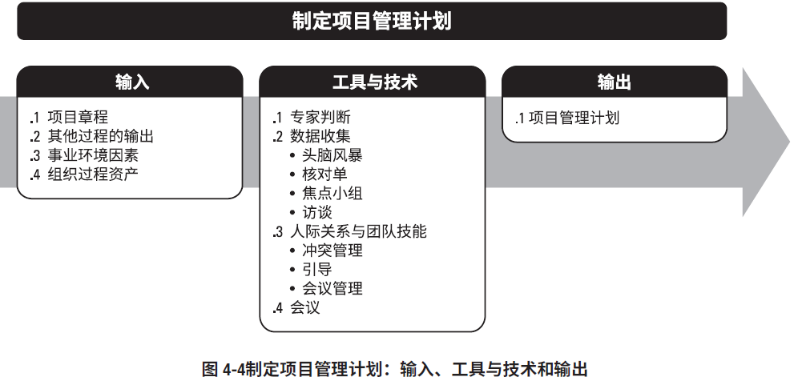
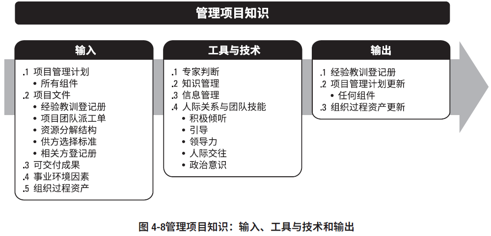
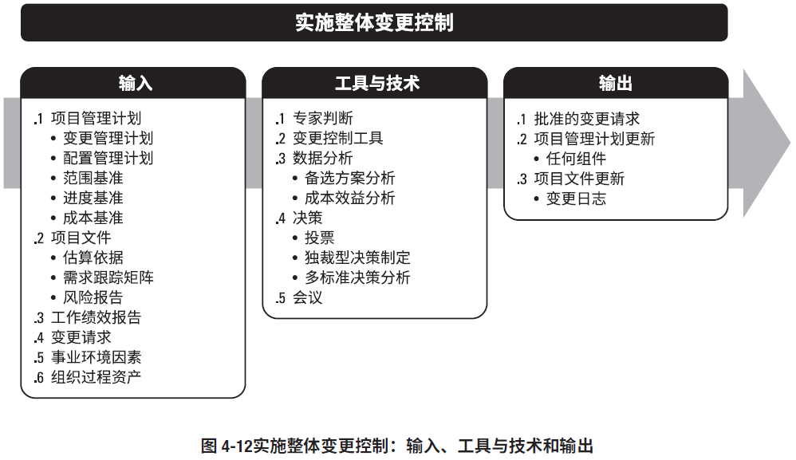
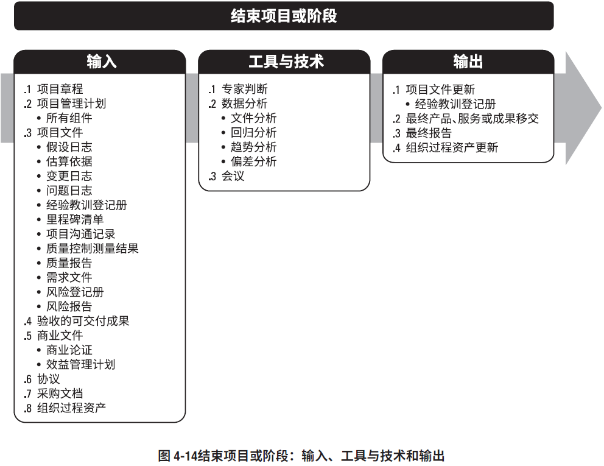
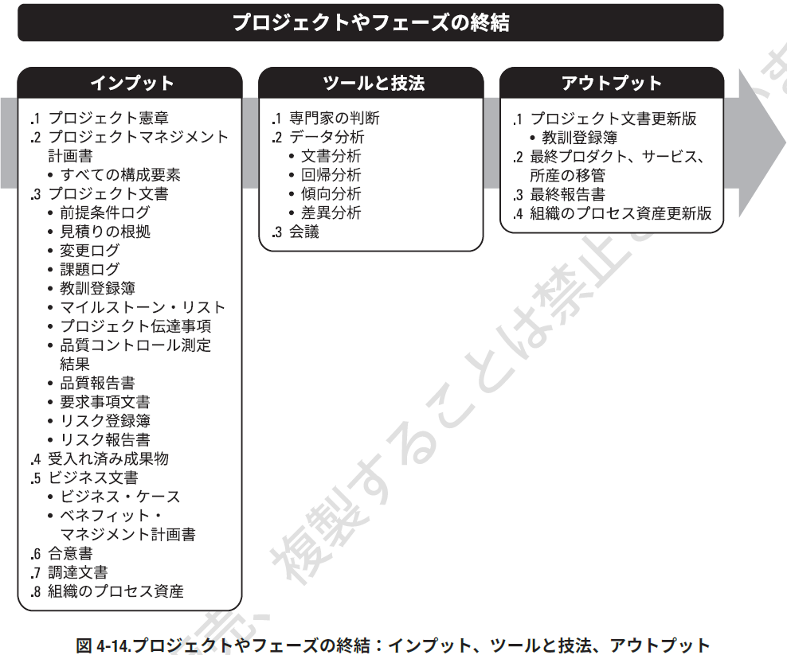

输入、工具与技术和输出  

| インプット         | ツールと技法                   | アウトプット     |
|--------------------|--------------------------------|------------------|
| ビジネス文書       | 専門家の判断                   | プロジェクト憲章 |
| 合意書             | データ収集                     | 前提条件ログ     |
| 組織体の環境要因   | 人間関係とチームに関するスキル |                  |
| 組織のプロセス資産 | 会議                           |                  |

