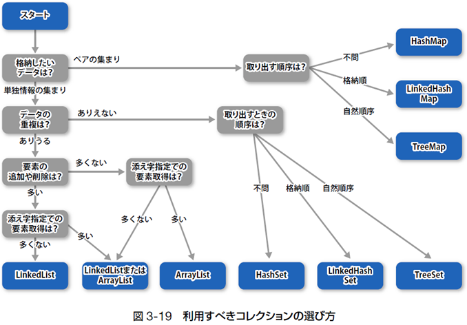

# プログラムの書き方

## 開発と実行の流れ
- Javaの文法に従いソースコードを作成する。  
- ソースコードをコンパイラでコンパイルして、<u>バイトコード</u>に変換する。  
- インタプリタはバイトコードを**マシン語**に変換しながらCPUを動かす。  

## 開発の流れと基本構造
- ソースコードはブロックによる二重構造を持っている。  
- 外側部分は形式的記述であり、内側に**文**を並べる。  
- 読みやすいソースにするためコメントとインデントを活用する。  

## 変数宣言の文
- 変数は**「型　変数名;」**で宣言して利用する。  
- 変数名は基本的に自由だが、一定の制約がある。  
- 変数には代表的な**9つの型**があり、用途に合わせて使い分ける。  
- **final**を付けて宣言された定数の値は書き換えられない。  

